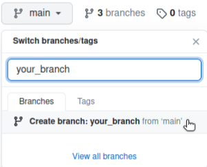
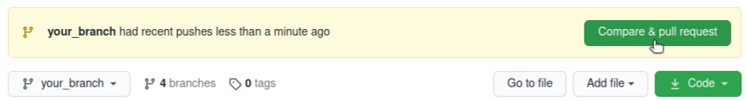
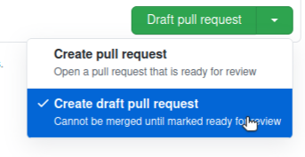
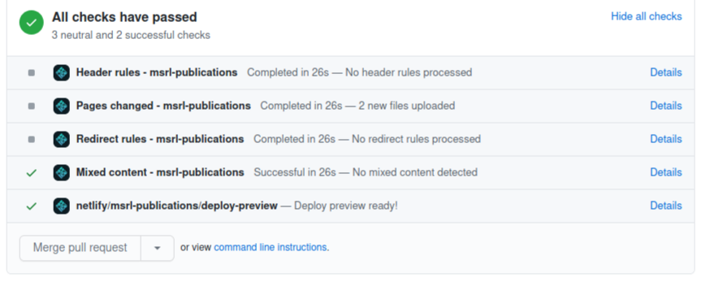
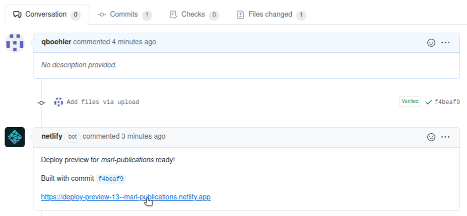
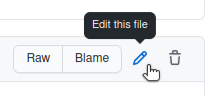
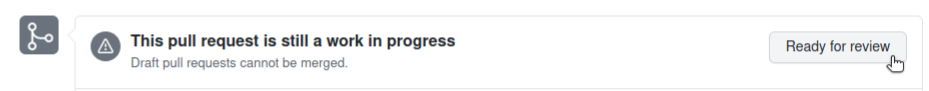

# Website pages for MSRL publications 

This repository contains the files to advertise your publications on the MSRL publications website as a member of the lab.

<!--- TODO: ADD LINK TO THE PUBLISHED SITE --->

## Prepare the entry

### Prepare the content and material

- Prepare a teaser for your paper
   - Prepare your teaser video and upload it on the Youtube channel from MSRL (credentials available [here](https://wiki.msrl.ethz.ch/index.php/MSRL_Members:Youtube)) <br>
   **OR**
   - Prepare an image ```<publication_name>.png``` of size 400 x 400. ```<publication_name>``` must match the filename of your post exactly without the date.
- Prepare an icon image ```<publication_name>_small.png``` of size 150 x 150 to be displayed next to the publication entry on the website main page.

Additionnaly, you are strongly encouraged to prepare richer content for the webpage (e.g. links to other websites where the work have been advertised, links to open-source code or datasets, videos uploaded on Youtube, additionnal comments and explanations on the work that are not in the abstract...).

### Prepare the files
- Download the post and author [templates](https://github.com/ethz-msrl/MSRL_Publications/releases/download/1/templates.zip). They are also found in 
```_posts/template.markdown``` and  ```_authors/template.markdown```.
- Create a file ```<publication_date>-<publication_name>.markdown``` based on the publication template and fill it in with the required information. Publication date ```<publication_date>``` must be in yyyy-mm-dd format. Make sure to put a dash between the date and the filename.
- Create as many authors files ```<firstname>_<lastname>.markdown``` as required (only for authors that are not already in the folder ```_authors```) and fill it in with the author's full name at least. *Make sure the full name matches the author names in the posts exactly*. For members of the group, it can make more sense to put more info up there like links to your researchgate profile, a picture, biography and whatever content you want. This can be a good way to display your research work.

Content is generated using markdown, a way to write rich documents using text only. You can learn how to write markdown in a few minutes. You can find [here](https://www.markdowntutorial.com/) a tutorial to start learning how to write markdown.

## Submit and preview

First, you are going to add your files on a site that is only for preview, and is therefore not public.

### Upload files

- Create a new branch (upper-left corner). If this is a new publication, call the branch ```post/<publication_name>```, where ```<publication_name>``` matches the filename of your post.



- Upload the paper file in the folder ```_posts``` 
- Upload the author files in the folder ```_authors```
- Upload the images files in the folder ```images```

To upload a file:
- Go to the desired folder
- Click 'Add file/Upload files' (upper-right corner)
- Add your file(s)
- Click 'Commit changes'

### Submit files

To preview your contribution, you have to create a new pull request:

- Click 'Compare & Pull request'



- Under 'Create pull request', 'Click 'Draft pull request'



This automaticaly starts generating a preview.

### Preview and modify files

The generation of the preview may take up to 30 seconds. The preview is ready once all of the checks have passed:



Once the preview is ready, a new comment from netlify appears with a link to the preview page: 



It is time to check your submission:
- Verify the publication pages (text, links and images)
- Verify the author pages (text, links and images)

If editions are needed, the ```.markdown``` files can be edited from the GitHub interface (go to your file and click 'Edit this file' in the upper-rigth corner). Make sure you always commit the changes after edition. You can also replace or delete images or any other files.



The preview link is updated and the checks ran anew for each new commit, just follow the same steps described in *Submit files* and wait for the preview link to be re-generated.

## Publish the entry

Once you are satisfied with the preview, request the moderators to publish your contributon on the public website. In the pull request page, click 'Ready for review'. 



You are done! Your commits are going to be reviewed by the moderators and published on the public website.


## Troubleshooting and FAQ

If you encounter an issue using GitHub, or at any step of the submission procedure, please refer to the 'Issues' section and use the search feature to look your problem up. If you cannot find an answer to your problem, click on 'Create issue' and provide a clear and concise description of your problem. Note that you can refer to pull requests, other issues, or even files.

More information on how to handle GitHub issues [here](https://guides.github.com/features/issues/).
